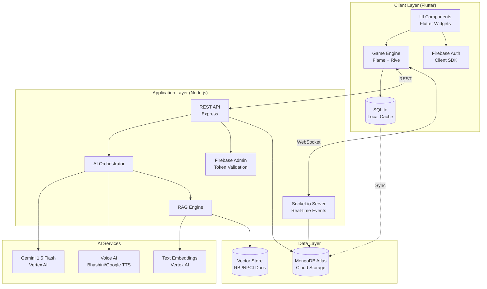

# Design Document: Bachat Bhaiya

## Overview

Bachat Bhaiya is architected as a hybrid mobile application combining offline-first gameplay with cloud-synchronized social features. The system uses a three-tier architecture:

1. **Client Layer** (Flutter + Flame Engine): Handles UI rendering, local game state, animations, and offline gameplay
2. **Application Layer** (Node.js + Socket.io): Manages real-time social features, AI orchestration, and business logic
3. **Data Layer** (MongoDB + SQLite): Provides cloud persistence and local caching

The design emphasizes:
- **Offline-first gameplay**: Core story progression and score management work without connectivity
- **AI-driven personalization**: Gemini 1.5 Flash generates contextual storylines and scam scenarios
- **Real-time social dynamics**: Socket.io enables instant P2P interactions and chat
- **Educational accuracy**: RAG system grounds all financial guidance in official RBI/NPCI documentation

### Key Design Decisions

**Why Flutter + Flame Engine?**
- Cross-platform deployment (Android/iOS) from single codebase
- Flame Engine provides 2D game primitives (sprites, animations, collision detection)
- Strong offline support with local database integration
- Rive integration for complex character animations

**Why Gemini 1.5 Flash via Vertex AI?**
- Long context window (1M tokens) enables rich persona-based story generation
- Fast inference (<2s) for real-time scam scenario generation
- Multimodal capabilities for future voice/image scam scenarios
- Cost-effective for high-frequency AI interactions

**Why Socket.io for real-time features?**
- Automatic fallback from WebSocket to HTTP long-polling
- Built-in room management for friend groups and collective goals
- Event-based architecture aligns with game state updates
- Efficient binary protocol for mobile networks

**Why hybrid MongoDB + SQLite?**
- SQLite provides instant local access for offline gameplay
- MongoDB handles complex social graph queries and aggregations
- Conflict resolution via server-authoritative timestamps
- Reduced mobile data usage through selective sync

## Architecture

### System Architecture Diagram



### Data Flow Patterns

**Story Arc Generation Flow:**
```
User selects persona → Client sends request to API → 
AI Orchestrator calls Gemini with persona template → 
Gemini generates 30-day arc with decision points → 
API stores arc in MongoDB → Client caches in SQLite → 
Game Engine renders first day's scenario
```

**Scam Combat Flow:**
```
Game Master triggers scam event → AI Orchestrator generates scenario via Gemini → 
RAG Engine validates against RBI guidelines → Client presents scenario → 
User responds → Client sends response to API → 
AI Orchestrator evaluates correctness → API updates scores → 
Client displays feedback with RBI citation
```

**P2P Lending Flow:**
```
User A initiates loan request → Client sends via Socket.io → 
Server calculates interest rate from Friendship_Score → 
Server notifies User B → User B accepts → 
Server atomically updates both users' Haveli_Scores in MongoDB → 
Server broadcasts updates via Socket.io → 
Both clients update local SQLite and UI
```

## Components and Interfaces

### 1. Game Engine (Client)

**Responsibilities:**
- Render game UI using Flutter widgets and Flame sprites
- Manage local game state (current story position, scores, inventory)
- Handle user input and game loop (30-60 FPS)
- Orchestrate animations via Rive
- Trigger sync operations when connectivity available

**Key Classes:**

```typescript
class GameState {
  userId: string
  persona: UserPersona
  haveliScore: number  // 0-100
  zubaanScore: number  // 0-100
  currentStoryArc: StoryArc
  currentDay: number
  badges: CyberShieldBadge[]
  
  updateScores(haveliDelta: number, zubaanDelta: number): void
  progressStory(): void
  saveToLocal(): Promise<void>
}

class StoryArc {
  id: string
  persona: UserPersona
  days: StoryDay[]  // 30 elements
  generatedAt: Date
  
  getCurrentDay(): StoryDay
  getDecisionPoints(): DecisionPoint[]
}

class DecisionPoint {
  id: string
  scenario: string
  options: DecisionOption[]
  correctOptionId: string
  
  evaluate(selectedOptionId: string): ScoreImpact
}
```

**Interfaces:**

```typescript
interface IGameEngine {
  initialize(userId: string): Promise<void>
  loadGameState(): Promise<GameState>
  processDecision(decisionId: string, optionId: string): Promise<ScoreImpact>
  syncToCloud(): Promise<SyncResult>
}

interface ILocalStorage {
  saveGameState(state: GameState): Promise<void>
  loadGameState(userId: string): Promise<GameState | null>
  saveChatHistory(messages: ChatMessage[]): Promise<void>
  getChatHistory(friendId: string, limit: number): Promise<ChatMessage[]>
}
```

### 2. AI Orchestrator (Server)

**Responsibilities:**
- Route AI requests to appropriate services (Gemini, TTS, RAG)
- Manage prompt templates for different personas and scenarios
- Implement retry logic and fallback strategies
- Cache frequently generated content
- Rate limit AI API calls per user

**Key Classes:**

```typescript
class AIOrchestrator {
  geminiClient: GeminiClient
  ragEngine: RAGEngine
  ttsService: TTSService
  
  async generateStoryArc(persona: UserPersona, context: UserContext): Promise<StoryArc>
  async generateScamScenario(persona: UserPersona, scamType: ScamType): Promise<ScamScenario>
  async evaluateScamResponse(scenario: ScamScenario, userResponse: string): Promise<EvaluationResult>
  async generateDailyBriefing(userId: string, yesterdayDecisions: Decision[]): Promise<DailyBriefing>
}

class GeminiClient {
  vertexAIClient: VertexAI
  
  async generateText(prompt: string, temperature: number): Promise<string>
  async generateStructured<T>(prompt: string, schema: JSONSchema): Promise<T>
}

class RAGEngine {
  vectorStore: VectorDatabase
  embeddingService: EmbeddingService
  
  async retrieveRelevantGuidelines(query: string, topK: number): Promise<RBIGuideline[]>
  async generateGroundedResponse(query: string, context: string): Promise<string>
  async refreshKnowledgeBase(): Promise<void>
}
```

**Prompt Templates:**

```typescript
const STORY_ARC_PROMPT = `
You are generating a 30-day financial life simulation for a {persona} in India.

Persona Context:
- Role: {persona}
- Background: {background}
- Financial Goals: {goals}

Generate a JSON story arc with:
1. 30 daily scenarios with realistic financial decisions
2. Each scenario should have 2-4 options with clear financial outcomes
3. Include mix of: savings decisions, spending choices, investment opportunities, scam encounters
4. Ensure cultural relevance to Indian context
5. Difficulty should gradually increase over 30 days

Output Format:
{
  "days": [
    {
      "dayNumber": 1,
      "scenario": "...",
      "decisionPoints": [...]
    }
  ]
}
`;

const SCAM_GENERATION_PROMPT = `
Generate a realistic {scamType} scam scenario for a {persona} in India.

Requirements:
1. Scenario must be believable and contextually appropriate
2. Include specific red flags that users should identify
3. Reference real scam tactics documented by RBI/NPCI
4. Provide 3-4 response options (1 correct, others fall for scam)

Context from RAG:
{ragContext}

Output Format:
{
  "scenario": "...",
  "medium": "SMS|Call|Email|App",
  "redFlags": [...],
  "options": [...]
}
`;
```

### 3. Social Banking Module (Server)

**Responsibilities:**
- Manage friend connections and Friendship_Scores
- Process P2P lending transactions atomically
- Calculate dynamic interest rates
- Handle collective goal pooling and distribution
- Moderate chat content
- Broadcast real-time updates via Socket.io

**Key Classes:**

```typescript
class SocialBankingModule {
  socketServer: SocketIO.Server
  db: MongoDB
  
  async createLendingRequest(lenderId: string, borrowerId: string, amount: number, duration: number): Promise<LoanContract>
  async acceptLoan(loanId: string): Promise<TransactionResult>
  async repayLoan(loanId: string): Promise<TransactionResult>
  async calculateInterestRate(lenderId: string, borrowerId: string): Promise<number>
  async updateFriendshipScore(user1Id: string, user2Id: string, delta: number): Promise<void>
}

class FriendshipScoreCalculator {
  async getScore(user1Id: string, user2Id: string): Promise<number>
  async updateScore(user1Id: string, user2Id: string, event: SocialEvent): Promise<number>
  
  private calculateDelta(event: SocialEvent): number {
    // Loan repaid on time: +8
    // Loan defaulted: -15
    // Positive chat interaction: +2
    // Collective goal completed: +5
  }
}

class LoanContract {
  id: string
  lenderId: string
  borrowerId: string
  amount: number
  interestRate: number  // Calculated from Friendship_Score
  dueDate: Date
  status: 'pending' | 'active' | 'repaid' | 'defaulted'
  
  calculateRepaymentAmount(): number
  isOverdue(): boolean
}
```

**Interest Rate Formula:**

```
base_rate = 20%  // Maximum annual rate
friendship_score = getFriendshipScore(lender, borrower)  // 0-100
discount_factor = friendship_score / 100
final_rate = base_rate * (1 - discount_factor)

Example:
- Friendship_Score = 80 → Rate = 20% * (1 - 0.8) = 4%
- Friendship_Score = 50 → Rate = 20% * (1 - 0.5) = 10%
- Friendship_Score = 20 → Rate = 20% * (1 - 0.2) = 16%
```

### 4. Scam Combat Engine (Server)

**Responsibilities:**
- Generate realistic scam scenarios using AI
- Validate scenarios against RBI/NPCI guidelines via RAG
- Evaluate user responses for correctness
- Track scam detection statistics
- Award Cyber_Shield_Badges
- Schedule scam frequency (2-4 per week per user)

**Key Classes:**

```typescript
class ScamCombatEngine {
  aiOrchestrator: AIOrchestrator
  ragEngine: RAGEngine
  scheduler: ScamScheduler
  
  async generateScam(userId: string): Promise<ScamScenario>
  async evaluateResponse(scenarioId: string, userResponse: UserResponse): Promise<EvaluationResult>
  async getScamStatistics(userId: string): Promise<ScamStats>
}

class ScamScenario {
  id: string
  type: ScamType  // 'phishing' | 'fake_bill' | 'deepfake_voice' | 'upi_fraud' | 'lottery'
  persona: UserPersona
  content: string
  medium: 'sms' | 'call' | 'email' | 'app_notification'
  redFlags: string[]
  options: ScamOption[]
  correctOptionId: string
  rbiReference: string  // Citation from RAG
  
  isCorrectResponse(optionId: string): boolean
}

class ScamScheduler {
  async scheduleNextScam(userId: string): Promise<Date>
  async shouldTriggerScam(userId: string): Promise<boolean>
  
  private calculateNextScamTime(userStats: ScamStats): Date {
    // Frequency: 2-4 scams per week
    // Adjust based on user performance (more scams if struggling)
    // Minimum 24 hours between scams
  }
}
```

**Scam Types and Red Flags:**

```typescript
const SCAM_TYPES = {
  phishing: {
    redFlags: [
      'Urgent action required',
      'Suspicious sender email/number',
      'Requests for OTP or password',
      'Grammatical errors',
      'Unfamiliar links'
    ],
    rbiGuideline: 'RBI/2021-22/125 - Customer Protection'
  },
  fake_bill: {
    redFlags: [
      'Unexpected bill amount',
      'Unknown merchant name',
      'Pressure to pay immediately',
      'No official invoice number'
    ],
    rbiGuideline: 'NPCI Circular 2022-01 - UPI Safety'
  },
  deepfake_voice: {
    redFlags: [
      'Unusual background noise',
      'Robotic voice patterns',
      'Requests for money transfer',
      'Claims of emergency without verification'
    ],
    rbiGuideline: 'RBI/2023-24/89 - Digital Fraud Prevention'
  }
}
```

### 5. Bachat Bhaiya Daily Loop (Server + Client)

**Responsibilities:**
- Generate personalized daily briefings
- Compile yesterday's decision audit
- Fetch relevant market news for persona
- Deliver safety briefs after scam encounters
- Coordinate voice narration via TTS

**Key Classes:**

```typescript
class BachatBhaiyaService {
  aiOrchestrator: AIOrchestrator
  newsService: NewsService
  
  async generateDailyLoop(userId: string): Promise<DailyLoop>
  async generateAudit(userId: string, yesterdayDecisions: Decision[]): Promise<Audit>
  async generateNewsFeed(persona: UserPersona): Promise<NewsFeed>
  async generateSafetyBrief(scamEncounter: ScamScenario): Promise<SafetyBrief>
}

class DailyLoop {
  audit: Audit
  newsFeed: NewsFeed
  safetyBrief?: SafetyBrief  // Only if scam encountered yesterday
  
  async renderWithVoice(language: string): Promise<AudioLoop>
}

class Audit {
  date: Date
  decisions: DecisionOutcome[]
  haveliChange: number
  zubaanChange: number
  highlights: string[]  // AI-generated insights
  
  categorizeDecisions(): { hits: DecisionOutcome[], misses: DecisionOutcome[] }
}

class SafetyBrief {
  scamType: ScamType
  explanation: string
  rbiGuidelines: RBIGuideline[]
  helplineDemo: HelplineDemo
  
  async renderWithVoice(language: string): Promise<AudioBrief>
}

class HelplineDemo {
  steps: string[]  // Step-by-step guide to call 1930
  visualAids: string[]  // Screenshot/animation URLs
  
  generateInteractiveTutorial(): Tutorial
}
```

### 6. Voice AI System (Server)

**Responsibilities:**
- Convert text to speech for daily briefings and news
- Support multiple Indian languages
- Provide speech-to-text for voice responses
- Manage audio playback controls
- Cache frequently used audio clips

**Key Classes:**

```typescript
class VoiceAISystem {
  bhashiniClient: BhashiniAPI
  googleTTSClient: GoogleCloudTTS
  audioCache: AudioCache
  
  async textToSpeech(text: string, language: string, voice: VoiceProfile): Promise<AudioBuffer>
  async speechToText(audio: AudioBuffer, language: string): Promise<string>
  async getCachedAudio(textHash: string): Promise<AudioBuffer | null>
}

class VoiceProfile {
  language: string  // 'hi' | 'en' | 'ta' | 'te' | 'bn'
  gender: 'male' | 'female'
  speed: number  // 0.8 - 1.2
  pitch: number  // 0.8 - 1.2
}

interface AudioCache {
  set(key: string, audio: AudioBuffer, ttl: number): Promise<void>
  get(key: string): Promise<AudioBuffer | null>
  invalidate(pattern: string): Promise<void>
}
```

**Language Support:**

```typescript
const SUPPORTED_LANGUAGES = {
  hi: { name: 'Hindi', ttsProvider: 'bhashini', voiceId: 'hi-IN-Wavenet-A' },
  en: { name: 'English', ttsProvider: 'google', voiceId: 'en-IN-Wavenet-D' },
  ta: { name: 'Tamil', ttsProvider: 'bhashini', voiceId: 'ta-IN-Wavenet-A' },
  te: { name: 'Telugu', ttsProvider: 'bhashini', voiceId: 'te-IN-Wavenet-A' },
  bn: { name: 'Bengali', ttsProvider: 'bhashini', voiceId: 'bn-IN-Wavenet-A' }
}
```

## Data Models

### User Profile

```typescript
interface UserProfile {
  id: string  // Firebase UID
  phoneNumber: string
  persona: 'farmer' | 'student' | 'housewife' | 'corporate_employee'
  haveliScore: number  // 0-100
  zubaanScore: number  // 0-100
  currentStoryArcId: string
  currentDay: number
  language: string
  badges: Badge[]
  createdAt: Date
  lastActiveAt: Date
  
  // Indexes
  _indexes: {
    phoneNumber: 'unique',
    persona: 'non-unique',
    lastActiveAt: 'non-unique'
  }
}
```

### Story Arc

```typescript
interface StoryArc {
  id: string
  userId: string
  persona: UserPersona
  generatedAt: Date
  days: StoryDay[]  // Array of 30 days
  
  _indexes: {
    userId: 'non-unique',
    generatedAt: 'non-unique'
  }
}

interface StoryDay {
  dayNumber: number  // 1-30
  scenario: string
  decisionPoints: DecisionPoint[]
  completedAt?: Date
}

interface DecisionPoint {
  id: string
  question: string
  options: DecisionOption[]
  correctOptionId: string
  haveliImpact: { [optionId: string]: number }
  zubaanImpact: { [optionId: string]: number }
}

interface DecisionOption {
  id: string
  text: string
  explanation: string  // Shown after selection
}
```

### Friendship

```typescript
interface Friendship {
  id: string
  user1Id: string
  user2Id: string
  friendshipScore: number  // 0-100, initialized at 50
  establishedAt: Date
  lastInteractionAt: Date
  interactionHistory: SocialEvent[]
  
  _indexes: {
    user1Id_user2Id: 'compound-unique',
    lastInteractionAt: 'non-unique'
  }
}

interface SocialEvent {
  type: 'loan_repaid' | 'loan_defaulted' | 'chat_positive' | 'collective_goal_completed'
  timestamp: Date
  scoreDelta: number
  metadata: Record<string, any>
}
```

### Loan Contract

```typescript
interface LoanContract {
  id: string
  lenderId: string
  borrowerId: string
  amount: number
  interestRate: number  // Annual percentage
  issuedAt: Date
  dueDate: Date
  repaidAt?: Date
  status: 'pending' | 'active' | 'repaid' | 'defaulted'
  friendshipScoreAtIssue: number
  
  _indexes: {
    lenderId: 'non-unique',
    borrowerId: 'non-unique',
    status: 'non-unique',
    dueDate: 'non-unique'
  }
}
```

### Collective Goal

```typescript
interface CollectiveGoal {
  id: string
  creatorId: string
  title: string
  description: string
  targetAmount: number
  currentAmount: number
  deadline: Date
  participants: Participant[]
  status: 'active' | 'completed' | 'failed'
  createdAt: Date
  
  _indexes: {
    creatorId: 'non-unique',
    status: 'non-unique',
    deadline: 'non-unique'
  }
}

interface Participant {
  userId: string
  contributedAmount: number
  joinedAt: Date
}
```

### Scam Encounter

```typescript
interface ScamEncounter {
  id: string
  userId: string
  scenarioId: string
  scamType: ScamType
  presentedAt: Date
  respondedAt?: Date
  userResponse?: string
  wasCorrect?: boolean
  haveliImpact: number
  badgeAwarded?: string
  
  _indexes: {
    userId: 'non-unique',
    presentedAt: 'non-unique',
    scamType: 'non-unique'
  }
}
```

### Chat Message

```typescript
interface ChatMessage {
  id: string
  senderId: string
  receiverId: string
  content: string
  sentAt: Date
  deliveredAt?: Date
  readAt?: Date
  isModerated: boolean
  
  _indexes: {
    senderId_receiverId: 'compound',
    sentAt: 'non-unique'
  }
}
```

### Badge

```typescript
interface Badge {
  id: string
  userId: string
  type: 'scam_detection' | 'lending_mastery' | 'savings_champion' | 'community_builder' | 'helpline_trained'
  title: string
  description: string
  earnedAt: Date
  rarity: 'common' | 'rare' | 'epic' | 'legendary'
  
  _indexes: {
    userId: 'non-unique',
    type: 'non-unique',
    earnedAt: 'non-unique'
  }
}
```

### RBI Guideline (Vector Store)

```typescript
interface RBIGuideline {
  id: string
  circularNumber: string
  title: string
  content: string
  category: 'customer_protection' | 'digital_payments' | 'fraud_prevention' | 'lending_norms'
  publishedDate: Date
  embedding: number[]  // 768-dimensional vector
  
  _indexes: {
    circularNumber: 'unique',
    category: 'non-unique',
    embedding: 'vector-index'
  }
}
```

## Correctness Properties

*A property is a characteristic or behavior that should hold true across all valid executions of a system—essentially, a formal statement about what the system should do. Properties serve as the bridge between human-readable specifications and machine-verifiable correctness guarantees.*


### Property 1: Persona Selection Initialization

*For any* selected persona (Farmer, Student, Housewife, Corporate_Employee), when a user completes persona selection, the system should store the persona choice, initialize Haveli_Score and Zubaan_Score to valid starting values (both in range [0, 100]), and persist the profile to local storage such that it can be immediately retrieved.

**Validates: Requirements 1.2, 1.4**

### Property 2: Story Arc Structure Validity

*For any* generated Story_Arc, it should contain exactly 30 StoryDay elements, include minimum 15 DecisionPoint objects across all days, and every DecisionPoint should have defined haveliImpact and zubaanImpact mappings for all options.

**Validates: Requirements 2.1, 2.3**

### Property 3: Story Arc Persona Relevance

*For any* User_Persona and generated Story_Arc, the story content should contain persona-specific keywords and scenarios (e.g., "crop", "loan", "harvest" for Farmer; "tuition", "exam", "scholarship" for Student; "household", "budget", "groceries" for Housewife; "salary", "appraisal", "office" for Corporate_Employee).

**Validates: Requirements 2.2**

### Property 4: Story Arc Continuity

*For any* completed Story_Arc, the system should automatically generate a new 30-day Story_Arc within 24 hours, and the new arc should reference events or outcomes from the previous arc to maintain narrative continuity.

**Validates: Requirements 2.4**

### Property 5: Daily Audit Generation

*For any* set of financial decisions made in the previous 24 hours, when a user opens the app, the Bachat_Bhaiya should generate an Audit that categorizes all decisions into "Hits" (positive outcomes) and "Misses" (negative outcomes), and displays the total Haveli_Score and Zubaan_Score changes.

**Validates: Requirements 3.1, 3.2**

### Property 6: Persona-Relevant News Feed

*For any* User_Persona, when The News Feed is generated, it should contain market updates and financial news relevant to that persona's domain (agricultural prices for Farmer, education costs for Student, household goods for Housewife, corporate sector for Corporate_Employee).

**Validates: Requirements 3.3**

### Property 7: Conditional Safety Brief

*For any* user who encountered at least one scam scenario in the previous 24 hours, when the daily loop is generated, it should include a Safety_Brief that explains the scam type, cites at least one RBI circular number, and demonstrates the 1930 Cybercrime Helpline process.

**Validates: Requirements 3.5, 14.1**

### Property 8: Score Bounds Invariant

*For any* financial or social decision that updates Haveli_Score or Zubaan_Score, the resulting scores should remain within the valid range [0, 100], with the system clamping values that would exceed bounds.

**Validates: Requirements 4.1, 4.2**

### Property 9: Score Persistence Round-Trip

*For any* Haveli_Score and Zubaan_Score update, the new values should be immediately persisted to local SQLite storage such that querying the database returns the exact updated values.

**Validates: Requirements 4.4, 13.1**

### Property 10: Friendship Initialization

*For any* two users establishing a new friendship connection, the system should create a bidirectional Friendship record with Friendship_Score initialized to exactly 50, and both users should appear in each other's friend lists.

**Validates: Requirements 5.1, 7.1**

### Property 11: Chat Message Persistence

*For any* sequence of chat messages sent between two users, when chat history is requested, the system should retrieve all messages in chronological order (sorted by sentAt timestamp) with no duplicates or omissions.

**Validates: Requirements 5.3**

### Property 12: Message Content Validation

*For any* chat message, the system should accept messages with length ≤ 500 characters and no profanity, reject messages with length > 500 characters or containing profanity, and provide appropriate feedback to the sender.

**Validates: Requirements 5.4, 20.1, 20.2**

### Property 13: Offline Message Queuing

*For any* message sent while the recipient is offline, the system should queue the message and deliver it within 5 seconds of the recipient reconnecting, maintaining message order.

**Validates: Requirements 5.5**

### Property 14: Lending Balance Validation

*For any* P2P lending request, the system should reject the request if the lender's Haveli_Score is less than the requested loan amount, and accept it if the balance is sufficient.

**Validates: Requirements 6.1**

### Property 15: Interest Rate Calculation Formula

*For any* Friendship_Score value in range [0, 100], when calculating P2P lending interest rate, the system should apply the formula: rate = 20% * (100 - Friendship_Score) / 100, resulting in rates within range [0%, 20%].

**Validates: Requirements 6.2, 7.5**

### Property 16: Loan Transaction Atomicity

*For any* accepted loan between lender and borrower, the system should atomically: (1) decrease lender's Haveli_Score by loan amount, (2) increase borrower's Haveli_Score by loan amount, (3) create LoanContract record, such that the total virtual currency in the system is conserved.

**Validates: Requirements 6.3**

### Property 17: Loan Repayment Score Updates

*For any* loan repayment, if repaid on or before due date, the system should increase borrower's Zubaan_Score and the Friendship_Score between lender and borrower; if repaid after due date, the system should decrease both scores.

**Validates: Requirements 6.5, 6.6**

### Property 18: Friendship Score Update Bounds

*For any* social event (successful loan, defaulted loan, positive interaction), when updating Friendship_Score, the delta should be within defined ranges: successful lending [+5, +10], loan default [-10, -20], positive interaction [+1, +3], and the resulting score should remain in [0, 100].

**Validates: Requirements 7.2, 7.3, 7.4**

### Property 19: Collective Goal Structure

*For any* created Collective_Goal, it should have defined targetAmount, deadline, participant list, and the currentAmount should equal the sum of all individual participant contributions at any point in time.

**Validates: Requirements 8.1, 8.2**

### Property 20: Collective Goal Currency Conservation

*For any* contribution to a Collective_Goal, the system should decrease the contributor's Haveli_Score by the contribution amount and increase the goal's currentAmount by the same amount, conserving total virtual currency.

**Validates: Requirements 8.3**

### Property 21: Collective Goal Completion

*For any* Collective_Goal that reaches currentAmount ≥ targetAmount before the deadline, the system should distribute the community asset to all participants and mark the goal as completed.

**Validates: Requirements 8.4**

### Property 22: Collective Goal Refund

*For any* Collective_Goal that reaches deadline with currentAmount < targetAmount, the system should refund each participant's contribution to their Haveli_Score and mark the goal as failed, conserving total virtual currency.

**Validates: Requirements 8.5**

### Property 23: Scam Activation Threshold

*For any* user, the system should not generate scam scenarios if the user has been active for fewer than 3 days, and should begin generating scams once the user has been active for 3 or more days.

**Validates: Requirements 9.1**

### Property 24: Scam Type Coverage

*For any* generated scam scenario, it should belong to exactly one of the defined categories: Phishing, Fake Bills, Deepfake Voice Calls, UPI Fraud, or Lottery Scams.

**Validates: Requirements 9.2**

### Property 25: Scam Contextual Relevance

*For any* generated scam scenario, the content should include references to the user's current User_Persona and Story_Arc context, making the scam believable within the user's narrative.

**Validates: Requirements 9.3**

### Property 26: Scam Frequency Bounds

*For any* user over any 7-day period, the system should generate between 2 and 4 scam scenarios (inclusive), with minimum 24 hours between consecutive scams.

**Validates: Requirements 9.4**

### Property 27: Scam Response Evaluation Performance

*For any* user response to a scam scenario, the system should complete evaluation and return feedback within 2 seconds.

**Validates: Requirements 10.1**

### Property 28: Scam Response Outcomes

*For any* scam response, if the user correctly identifies the scam, the system should increase Haveli_Score by [50, 100] points and award a Cyber_Shield_Badge; if the user falls for the scam, the system should decrease Haveli_Score by [100, 300] points and display educational feedback with RBI guideline citations.

**Validates: Requirements 10.2, 10.3, 10.4**

### Property 29: Badge Unlock Threshold

*For any* user, when the count of earned Cyber_Shield_Badges reaches exactly 5, the system should unlock advanced gameplay features (higher lending limits, exclusive story branches).

**Validates: Requirements 10.5**

### Property 30: RAG Guideline Retrieval Relevance

*For any* scam type, when retrieving RBI guidelines via RAG_System, the returned circulars should contain keywords related to the scam type (e.g., "phishing", "digital fraud" for Phishing scams; "UPI", "payment fraud" for UPI Fraud).

**Validates: Requirements 11.1**

### Property 31: Educational Content Citations

*For any* educational content generated (Safety Brief, scam feedback), the content should include at least one specific RBI circular number (format: RBI/YYYY-YY/NNN) or NPCI guideline reference.

**Validates: Requirements 11.2**

### Property 32: Financial Term Definitions

*For any* financial term explanation requested by a user, the RAG_System should return a definition that contains content matching official RBI documentation in the vector store.

**Validates: Requirements 11.4**

### Property 33: Multi-Language Support

*For any* voice AI operation (text-to-speech, speech-to-text),
